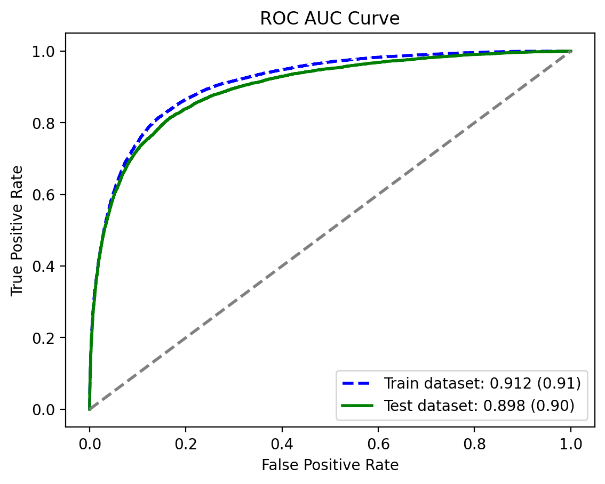

# Churn Prediction Model

In this project, i utilized the LightGBM (Light Gradient Boosting Machine) model to predict customer churn. Gradient boosting was chosen due to its high efficiency with large datasets and its ability to automatically handle missing values, making it ideal for churn prediction tasks.

## Task Description

### Type of Classification Task

This project focuses on a binary classification task, where the objective is to predict whether a client has churned (left the service) or not. The two possible outcomes are:

- Not churned clients (class 0)
- Churned clients (class 1)

Distribution of classes:

- Churned clients: 6-7%
- Not churned clients: 93-94%

### Navigation

- `pipeline.ipynb` - The main notebook that encompasses the entire training cycle, from data preparation to results analysis.
- `transform` - Directory containing all scripts for data preparation.
- `research` - Directory containing all notebooks and scripts used for experiments, exploratory data analysis (EDA),hyperparameter tuning, etc.
- `models` - Directory containing stored models.
- `data` - Directory containing the initial raw data. (HIDDEN)
- `cache` - Directory containing cached transformed data for faster access and reuse. (HIDDEN)

### Model Parameters:

```py
{
    "random_state": 42,
    "seed": 42,
    "objective": "binary",
    "metric": "auc",
    "verbosity": -1,
    "boosting_type": "gbdt",
    "feature_pre_filter": False,
    "n_jobs": -1,
    "lambda_l1": 8,
    "lambda_l2": 5,
    "learning_rate": 0.018,
    "num_leaves": 14,
    "feature_fraction": 0.6803603979260223,
    "bagging_fraction": 0.6735621254996546,
    "max_depth": 11,
    "min_child_samples": 30,
    "n_estimators": 350,
    "drop_rate": 0.2,
    "is_unbalance": True,
}
```

### Results



Train metrics

```
AUC: 0.912
F Beta score: 0.560
Matthews Correlation Coefficient: 0.451
Classification Report:
              precision    recall  f1-score   support

         0.0       0.96      0.99      0.97    140413
         1.0       0.68      0.33      0.45      9585

    accuracy                           0.95    149998
   macro avg       0.82      0.66      0.71    149998
weighted avg       0.94      0.95      0.94    149998
```

Test metrics

```
AUC: 0.898
F Beta score: 0.548
Matthews Correlation Coefficient: 0.441
Classification Report:
              precision    recall  f1-score   support

         0.0       0.96      0.99      0.97    140597
         1.0       0.66      0.33      0.44      9403

    accuracy                           0.95    150000
   macro avg       0.81      0.66      0.70    150000
weighted avg       0.94      0.95      0.94    150000
```
